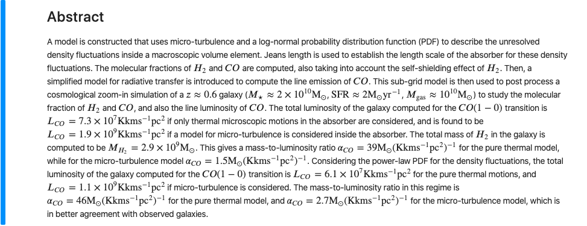
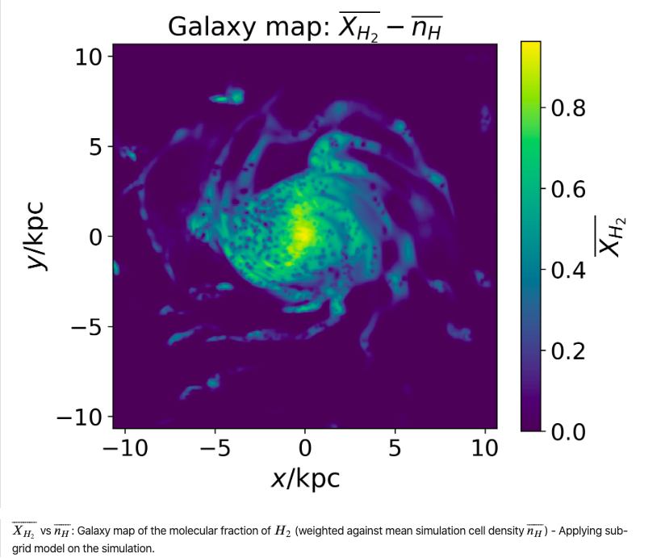
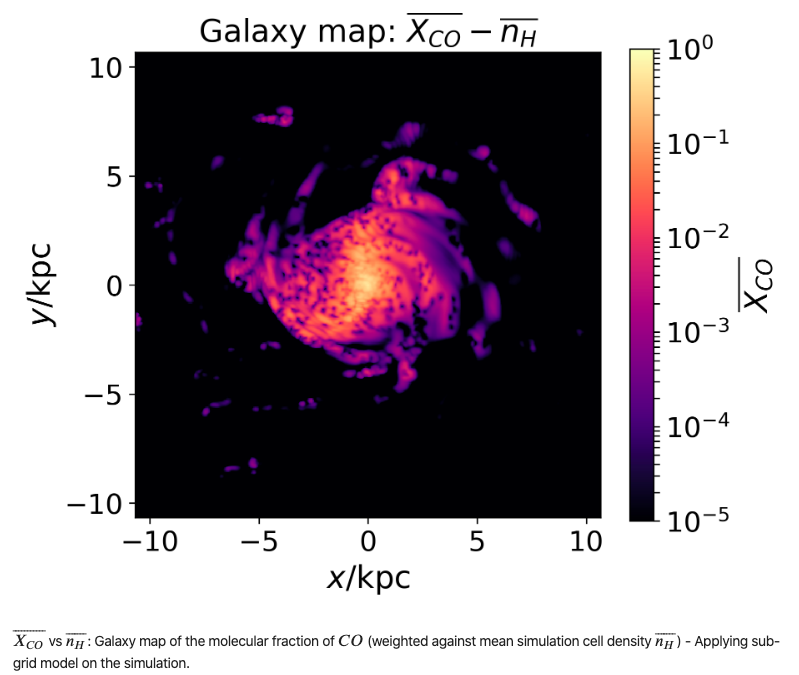
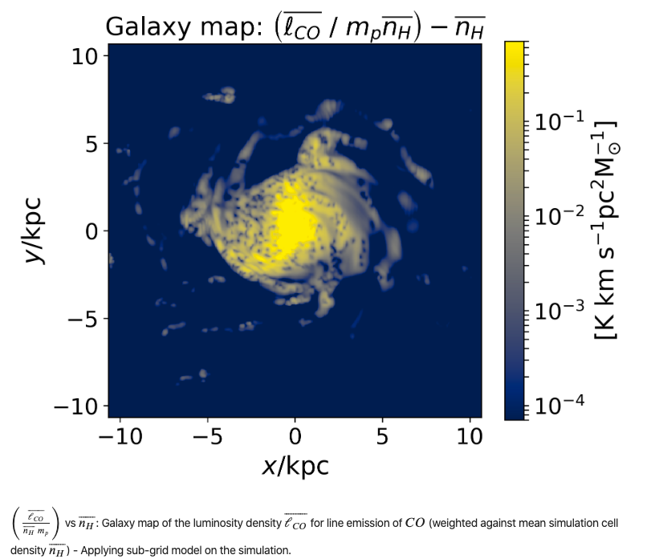

# sub_grid
___

# A sub-grid model for molecular gas in a cosmological galaxy formation simulation

### *Amandeep Singh*

### *Supervised by Prof. (Dr.) Romain Teyssier*

July 18, 2019

> 

> 

> 

> 
